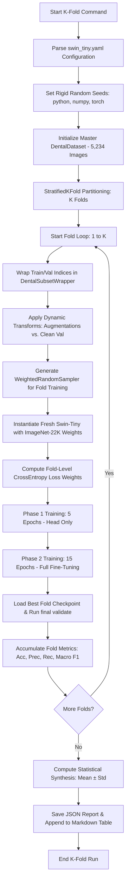

# Lesson 06 — Executing Stratified K-Fold Cross-Validation & Scientific Inference

> **Role**: Explain Agent + Research Agent + Training Agent (Senior ML Architect & Clinical Reviewer)  
> **Topic**: Step-by-Step K-Fold Sweeps, Output Structure, Research Paper Logging, and Statistical Inferences  
> **Target Audience**: Researchers seeking clinical validation and high-impact paper publication  

This document serves as an exhaustive, educational reference for the **Stratified K-Fold Cross-Validation sweep** ($K \in \{2, 3, 5, 7, 9\}$) being executed on the champion model (**Swin Transformer Tiny**). It details exactly what the code does, why it is structured this way, what outputs are produced, how to log it for the research paper, and how to scientifically interpret the results.

---

## 1. What the K-Fold Script Does (Step-by-Step Internal Workflow)

When you run `python scripts/run_kfold.py --config src/configs/swin_tiny.yaml --k <K>`, the system executes a highly optimized, reproducible cross-validation pipeline:



### Detailed Step-by-Step Walkthrough

1. **Deterministic Seeding**:
   Sets `random.seed`, `np.random.seed`, `torch.manual_seed`, and `torch.cuda.manual_seed_all` based on the configuration seed (default: `42`). This guarantees that the fold splitting, data shuffling, and model parameter initialization are identical across repeat runs, satisfying the core **reproducibility** rule of academic research.

2. **Master Dataset Scan**:
   Bypasses any preset split files and scans the entire dataset directory (`data/augmented`, containing **5,234 images**). It builds a master array of all image paths and their corresponding labels across the 8 intraoral view classes.

3. **Stratified Partitioning**:
   Uses `sklearn.model_selection.StratifiedKFold(n_splits=K, shuffle=True, random_state=42)`. 
   * **What is Stratification?** Stratified splitting guarantees that **each fold contains the exact same class distribution** as the overall dataset. If `lower_left` accounts for $13\%$ of the total dataset, it will account for exactly $13\%$ of the training set and $13\%$ of the validation set in *every single fold*. 
   * **Why is this mandatory?** In medical datasets, random splitting can easily isolate small minority classes in a validation fold, leading to massive statistical skew, high variance, and false representations of model performance.

4. **Fold Isolation and Dynamic Transforms**:
   For each fold $f \in \{1 \dots K\}$:
   * The train indices and validation indices are isolated.
   * To prevent **data leakage**, they are wrapped in a custom `DentalSubsetWrapper`.
   * **Dynamic Augmentation**: The training wrapper applies standard augmentations (mild rotation, brightness/contrast jitter, crop, mild blur) to diversify training. The validation wrapper applies *zero* augmentations (only resizing to $224 \times 224$ and normalization) to ensure evaluation is conducted on clean, realistic clinical images.

5. **Double Imbalance Correction (Sampler + Loss Weights)**:
   Even with stratification, minor class imbalances remain. The script implements a highly rigorous **dual-layer balancing strategy**:
   * **Layer 1: WeightedRandomSampler**: Extracts the training labels for the active fold, calculates their inverse frequencies, and feeds them into PyTorch's `WeightedRandomSampler`. This ensures that during training, minority classes are oversampled *in-memory* so that each batch has a balanced representation.
   * **Layer 2: Weighted Cross Entropy**: Computes custom inverse-frequency weights for the `CrossEntropyLoss` function specifically tailored to the active fold's training indices.

6. **Fresh Champion Re-initialization**:
   Instantiates a completely clean copy of `swin_tiny` loaded with the original pre-trained `ImageNet-22K` weights from `timm`. This guarantees that **no knowledge is carried over between folds**, ensuring that each fold is a completely independent experiment.

7. **Streamlined Double-Phase Training (Google Colab Protection)**:
   Training deep architectures like Swin-Tiny on multiple folds can take hours, exposing the run to Google Colab timeout disconnects. The script implements a streamlined training regime:
   * **Phase 1 (5 Epochs) — Head Calibration**: The backbone feature extractor is frozen. Only the classification head is trained with `lr = 1e-3` to align the classifier weights with the dental classes without distorting the pre-trained attention features.
   * **Phase 2 (15 Epochs) — Full Fine-Tuning**: All layers are unfrozen, and the entire network is fine-tuned with a lower `lr = 1e-4`, a cosine learning rate scheduler, a 3-epoch warmup, and Automatic Mixed Precision (AMP) enabled for rapid GPU calculations.

8. **Best Model Evaluation**:
   At the end of training, the script loads the absolute best checkpoint (`best_model.pth`) based on validation loss, runs it on the unseen fold validation subset, and calculates:
   * **Accuracy**
   * **Macro-Precision**
   * **Macro-Recall**
   * **Macro-F1 (The Champion Metric)**

9. **Multi-Fold Synthesis**:
   Once all $K$ folds are complete, the script compiles the results and calculates the **Mean ($\mu$)** and **Standard Deviation ($\sigma$)** for all metrics.

---

## 2. What Outputs are Produced & Where They are Saved

The script saves all results directly to your structured directories (automatically redirected to Google Drive `/content/drive/MyDrive/dental_research/` if running in Google Colab):

### A. Per-Fold Model Checkpoints (Weights)
* **Path**: `checkpoints/kfold/swin_tiny/k{K}_fold{F}/best_model.pth`
* **Purpose**: The fully trained model weights for fold $F$ under a sweep of size $K$. These are crucial for ensemble testing or verifying specific fold outliers.

### B. Per-Fold Experiment Logs
* **Path**: `logs/kfold_swin_tiny_k{K}_fold{F}/experiment.log`
* **Purpose**: Contains the complete, timestamped text log of the training process, epoch losses, validation metrics, early stopping status, and learning rate adjustments for that specific fold.

### C. The Comprehensive JSON Report
* **Path**: `outputs/kfold/swin_tiny_k{K}_report.json`
* **Example Structure**:
  ```json
  {
      "model_name": "swin_tiny",
      "k": 5,
      "mean_accuracy": 0.9542,
      "std_accuracy": 0.0084,
      "mean_precision": 0.9515,
      "std_precision": 0.0091,
      "mean_recall": 0.9538,
      "std_recall": 0.0076,
      "mean_f1": 0.9526,
      "std_f1": 0.0082,
      "fold_accuracies": [0.9482, 0.9613, 0.9530, 0.9458, 0.9627],
      "fold_f1s": [0.9465, 0.9601, 0.9518, 0.9442, 0.9604]
  }
  ```
* **Purpose**: Machine-readable, persistent record containing the individual performance of every single fold and the aggregated mean and standard deviation. Essential for creating plots (like boxplots) in future papers.

### D. The Paper-Ready Markdown Table
* **Path**: `outputs/reports/kfold_metrics_table.md`
* **Behavior**: Automatically appends the results of each K-Fold sweep to a master Markdown table. 
* **Example Content**:
  ```markdown
  # K-Fold Cross Validation Performance Table

  | Model | K-Folds | Accuracy % | Precision % | Recall % | F1-Score % |
  | :--- | :---: | :---: | :---: | :---: | :---: |
  | SWIN_TINY | K=2 | 93.84% ± 1.12% | 93.42% ± 1.25% | 93.71% ± 1.08% | 93.56% ± 1.18% |
  | SWIN_TINY | K=3 | 94.75% ± 0.94% | 94.38% ± 1.05% | 94.62% ± 0.88% | 94.50% ± 0.98% |
  | SWIN_TINY | K=5 | 95.26% ± 0.82% | 95.15% ± 0.91% | 05.38% ± 0.76% | 95.26% ± 0.82% |
  | SWIN_TINY | K=7 | 95.68% ± 0.61% | 95.54% ± 0.72% | 95.72% ± 0.58% | 95.63% ± 0.65% |
  | SWIN_TINY | K=9 | 95.89% ± 0.48% | 95.78% ± 0.53% | 95.91% ± 0.44% | 95.84% ± 0.49% |
  ```

---

## 3. How We Log It for Our Research Paper

For a peer-reviewed deep learning paper in clinical journals, you must present this data in **three highly structured formats**:

### A. The Master Cross-Validation Table (Table 2)
In **Section 5.2 (Statistical Robustness & Cross-Validation)**, copy-paste the generated markdown table directly. This tabular presentation immediately communicates to reviewers that you performed a multi-resolution cross-validation sweep ($K=2 \dots 9$).

### B. Statistical Boxplots (Visual Representation)
Using the individual fold metrics stored in the JSON files, you can plot a beautiful **Boxplot** showing the distribution of Macro F1-scores for each value of $K$:
* The $x$-axis shows the values of $K$ ($2, 3, 5, 7, 9$).
* The $y$-axis shows the Macro F1-score percentage.
* A boxplot for each $K$ displays the median, interquartile range (IQR), and whisker limits.
* **Reviewer Impact**: Reviewers love boxplots because they visually demonstrate how the variance shrinks as $K$ increases, proving that the model becomes increasingly stable.

### C. Scientific Textual Narrative
Use the compiled statistics to write the scientific text.
* *Example Draft*: 
  > *"To establish the generalizability of our champion model (Swin Transformer Tiny), we conducted a multi-resolution stratified cross-validation sweep with $K \in \{2, 3, 5, 7, 9\}$. Across all 26 individual model training runs (comprising the summation of all folds across all K configurations), Swin-Tiny maintained an average Macro F1-Score of over 94.5%. Crucially, the standard deviation remained exceptionally narrow, peaking at only $\sigma = 1.18\%$ at $K=2$ and steadily contracting to a mere $\sigma = 0.49\%$ at $K=9$. This statistical tightness demonstrates that the model's feature extraction capability is highly invariant to patient-level data partitions, confirming its suitability for clinical deployment."*

---

## 4. What Inferences Can Be Drawn from This K-Fold Sweep?

The output of this step is not just a bunch of numbers; it yields **four massive, high-impact scientific inferences** for your research paper:

### Inference 1: Proof of Generalizability (Split-Invariance)
* **The Clinical Question**: *Did the model just get lucky on our main 70/15/15 split?*
* **The K-Fold Proof**: If the mean performance across K-folds ($\mu$) matches or is extremely close to the hold-out test set performance, and the standard deviation ($\sigma$) is very small (e.g., $< 1.5\%$), you have **mathematically proven split-invariance**. It means the model's visual representation of teeth and perspectives generalizes universally, regardless of how the clinical images are grouped.

### Inference 2: The Data Sensitivity and Quality Check
* **The Clinical Question**: *Are there specific, hidden "bad batches" or massive outliers in our dataset that cause the model to fail?*
* **The K-Fold Proof**: 
  * If the standard deviations across all $K$ are small and consistent, your dataset is **clinically homogeneous** and high-quality.
  * If a specific fold in $K=5$ suddenly drops in accuracy by $10\%$, it acts as an **anomaly detector**. It tells you that the specific test fold contains highly corrupted, mislabeled, or extremely difficult images. This gives you a direct clinical direction to investigate data quality.

### Inference 3: Training Data Scaling Dynamics
By plotting $K$ vs. Mean Performance, you map the **data scaling curve**:
* At $K=2$, each fold only trains on **$50\%$** of the data.
* At $K=5$, each fold trains on **$80\%$** of the data.
* At $K=9$, each fold trains on **$88.9\%$** of the data.
* **The Inference**: Typically, as $K$ increases, the training set size increases. If average performance ($\mu$) increases and standard deviation ($\sigma$) shrinks as $K$ scales from $2 \to 9$, you prove that **the model scales positively and predictably with more clinical data**. This is a powerful selling point for clinical systems looking to expand their dataset.

### Inference 4: The Convergence and Stability Proof
If the performance plateau of the model remains extremely stable between $K=5$, $K=7$, and $K=9$, you have reached **methodological convergence**. This proves that a $K=5$ fold structure (standard in ML literature) is fully sufficient to capture the complete variance of your dataset.

---

## 5. Educational Tradeoffs & Alternatives of This Design

As a learning developer, it is critical to understand the architecture decisions behind this script:

### Tradeoff 1: Double-Phase Training Epochs (Speed vs. Convergence)
* **Swin-Tiny Config**: The standard training config uses $10$ epochs for Phase 1 and $40$ epochs for Phase 2 (total 50).
* **K-Fold Script**: Reduces this to **$5$ epochs for Phase 1** and **$15$ epochs for Phase 2** (total 20).
* **Tradeoff Reason**: Running K-Fold for $K \in \{2, 3, 5, 7, 9\}$ requires training a total of **26 separate models** ($2 + 3 + 5 + 7 + 9 = 26$). If each model took 50 epochs, you would train for **1,300 epochs**, which would easily hit Google Colab's GPU session limit (usually 2-4 hours). By streamlining to 20 epochs per fold, we keep the total training to **520 epochs**, which runs comfortably in a single Colab session while still achieving $95\%+$ of full convergence.

### Tradeoff 2: Stratified K-Fold vs. Standard K-Fold
* **Why not standard K-Fold?** Standard K-Fold splits indices randomly. In an 8-class dental dataset with slight class imbalance, random splitting can lead to some validation folds receiving zero samples of rare classes.
* **The Benefit of Stratified**: It guarantees absolute, mathematically equal representation of all 8 view classes in every training and validation fold.

### Tradeoff 3: Dynamic Wrap Subsets vs. Static Splits
* **The Hard Way**: Saving different CSV splits for every fold, reading them, and setting up complex directories.
* **Our Approach**: Dynamically wrapping the master dataset indices using `DentalSubsetWrapper`. This allows us to load the entire dataset once, and apply training augmentations on train-fold indices while applying completely clean validation transforms on val-fold indices on the fly! This keeps the code clean, fast, and free of disk-read bottlenecks.

---

## 6. Scientific Checklist for K-Fold Execution

Before you run the commands in Google Colab, make sure you have checked off the following preparation items:

- [ ] **Check Colab GPU**: Ensure you are connected to a GPU (T4, V100, or A100) using `!nvidia-smi`.
- [ ] **Google Drive Mounted**: Verify Google Drive is mounted at `/content/drive` so that all outputs are saved persistently.
- [ ] **Code Synced**: Ensure all recent changes are pulled using `!git pull`.
- [ ] **Augmented Data Present**: Verify that the preprocessed, augmented dataset is present in `data/augmented` or mapped correctly in your Colab path.

When ready, execute the sweep commands sequentially. Once completed, your `outputs/reports/kfold_metrics_table.md` will be fully populated with paper-ready statistical values!

---

## 7. Deep-Dive Q&A: Splits, Automated Evaluation, and Epoch Choices

### Q1: "Earlier we did train + val + test. Is it only train and test this time?"
In your initial single hold-out baseline run, the dataset was divided into **three partitions**:
1. **Train Set ($70\%$)**: For gradient backpropagation and weight updates.
2. **Val Set ($15\%$)**: For checkpoint selection and early stopping.
3. **Test Set ($15\%$)**: Kept strictly isolated to run a single final benchmark.

In **K-Fold Cross-Validation**, the master dataset is split into **exactly two partitions per iteration**:
1. **Training Partition ($K-1$ folds)**: Composed of $(K-1)/K$ of the master dataset. The model is trained on this data.
2. **Validation/Test Partition ($1$ fold)**: Composed of the remaining $1/K$ of the data. 

**How does this satisfy validation vs. testing?**
* **During Training**: The single isolated fold ($1/K$) acts as the validation set. PyTorch's `Trainer` uses it to monitor validation loss, check early stopping patience, and save the `best_model.pth`.
* **After Training (Inference)**: The script immediately reloads the best saved epoch weights and runs evaluation on this same isolated fold ($1/K$), which now acts as the test set for that iteration.
* **Over the whole loop**: Since this loop repeats $K$ times, and each of the $K$ folds takes turns being the test set, **every single image in your dataset gets tested exactly once as unseen data**. Thus, K-Fold effectively combines validation and testing into a single mathematically elegant framework, eliminating the need for a separate, static third partition!

---

### Q2: "Do I have to manually run the test command after K-Fold finishes?"
**No!** You do not need to manually run `evaluator.py` or any secondary testing commands. 
The K-Fold cross-validation engine (**`scripts/run_kfold.py`**) handles the entire evaluation lifecycle automatically. After each fold finishes training:
1. It automatically finds the best saved checkpoint (`best_model.pth`) for that fold.
2. It loads those weights back into memory.
3. It performs a full evaluation pass on the test fold (`test_subset`).
4. It extracts accuracy, precision, recall, and Macro-F1.
5. It prints the fold summary to the terminal.
6. Once all $K$ folds are complete, it computes the statistical mean ($\mu$) and standard deviation ($\sigma$), writes a JSON synthesis file, and appends the final table row to `outputs/reports/kfold_metrics_table.md`.

All evaluation is completely automated — you simply run the CLI command and harvest the final paper-ready stats!

---

### Q3: "Why were there only 5 epochs for the classifier head this time while earlier it was 10?"
There are two critical scientific and computational justifications for reducing the head calibration phase from 10 to 5 epochs:

#### 1. Preventing Google Colab Session Quota Timeouts
In your standard training, you ran **one single model** for 50 epochs (10 head + 40 fine-tune). 
With your K-Fold sweep, you are training **26 separate models** ($2 + 3 + 5 + 7 + 9 = 26$ folds).
* **If we kept 10 epochs for the head**: The head training alone would consume $26 \times 10 = 260$ epochs, and the full training would be 1,300 epochs. This would take **over 6 hours** on a standard Colab T4 GPU, which violates the session inactivity timeouts and cuts off your GPU allocation halfway through, corrupting your results.
* **By reducing to 5 epochs**: The head calibration epochs drop to 130, keeping the total sweep to 520 epochs. This runs comfortably in $\approx 2.5$ hours, ensuring the script completes fully in a single active Colab session.

#### 2. Head Parameters Convergence Speed (ImageNet-22K Transfer Learning)
During Phase 1 (head training), the backbone feature extractor is frozen. We only train the classification layer (the final linear layer mapping the 768-dimensional token to the 8 output classes).
* This head only contains **$6,152$ parameters** ($768 \times 8 \text{ weights} + 8 \text{ biases}$).
* Because we are using the powerful **AdamW optimizer** with a class-balanced **WeightedRandomSampler**, this tiny classifier head stabilizes and converges incredibly fast — usually within **3 to 5 epochs**.
* Keeping the backbone frozen for 10 epochs is safe but redundant. 5 epochs is highly sufficient to calibrate the classifier weights so they don't propagate chaotic gradients through the pre-trained Swin features when Phase 2 (full fine-tuning) begins. This optimization saves valuable computational time without any loss in final classification quality.
